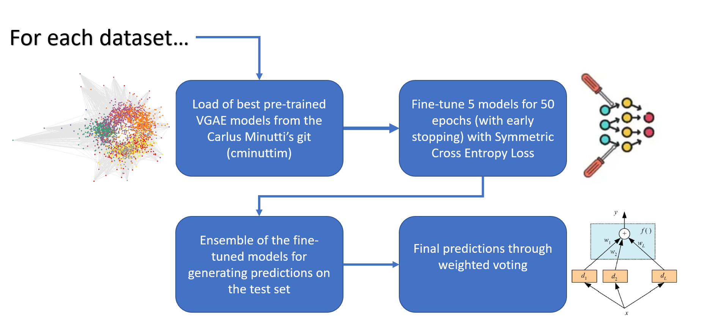

# Deep Learning Exam Hackaton


This repository contains the solution to the [Deep Learning Exam Hackathon Challenge](https://huggingface.co/spaces/examhackaton/GraphClassificationNoisyLabels).  
The project was developed by the team **Catch Us If You Can**, consisting of [Samuele Civale](https://github.com/samuelecivale) (ID: 1938135) and [Luca Conti](https://github.com/iamlucaconti) (ID: 1702084).

Our approach is based on fine-tuning pretrained models created by Carlos Minutti ([cminuttim](https://github.com/cminuttim/)), winner of the [IJCNN 2025 Competition: Learning with Noisy Graph Labels](https://sites.google.com/view/learning-with-noisy-graph-labe?usp=sharing). We apply the Symmetric Cross Entropy loss function during fine-tuning to better handle the label noise.

---

## Key Components

### 1. Variational Graph Autoencoder (VGAE)
- **Encoder:** The encoder maps the input graph to a latent space, capturing the essential patterns while filtering out noise.
- **Decoder:** The decoder reconstructs the graph from the latent space, ensuring that the learned representations are meaningful.
- **Loss Function:** The loss function used by ([cminuttim](https://github.com/cminuttim/)) combines reconstruction loss, KL divergence, and classification loss to train the model effectively. We resume the training changing the loss and using the Symmetric Cross-Entropy.

### 2. Ensemble of Models and Weighted Voting
- The predictions from the ensemble of models are combined using weighted voting, where the weights are the F1 scores of the models. This ensures that models with better performance contribute more to the final prediction.

---
## Teaser



---
## Procedure

1. **Fine-Tuning on Individual Datasets:**
   - Top-performing models developed by [cminuttim](https://github.com/cminuttim/) were fine-tuned separately on each dataset (e.g., dataset A).

2. **Prediction:**
   - An ensemble of fine-tuned models is used for generating predictions on the test set.
   - Final predictions are computed through weighted voting, where each model’s vote is scaled by its F1 score.

3. **Resuming Training:**
   - Training can be resumed from pretrained checkpoints, allowing for further tuning with modified hyperparameters such as learning rate or batch size.

---

## Usage

### Pretraining on All Datasets
To pretrain the model on all datasets (A, B, C, D) for 5 cycles:
```bash
python main.py --train_path "../A/train.json.gz ../B/train.json.gz ../C/train.json.gz ../D/train.json.gz" --num_cycles 5
```

### Fine-Tuning on a Specific Dataset
To fine-tune the model on dataset A using the pretrained model (this works if the `train.json.gz` file for the dataset A is in the folder `../A/train.json.gz`):
```bash
python main.py --train_path ../A/train.json.gz --test_path ../A/test.json.gz
```

Otherwise, if you want to specify also the `num_cycles` and the path of the pretrained models the model on dataset A (`model_paths_ABCD_A_.txt`):
```bash
python main.py --train_path ../A/train.json.gz --test_path ../A/test.json.gz --num_cycles 5 --pretrain_paths model_paths_ABCD_A.txt
```

### Prediction
To make predictions using the trained model on dataset A (this works if the `--pretrain_paths` txt file for dataset A is in the main folder):

```bash
python main.py --test_path ../A/test.json.gz
```

Otherwise, if you want to specify the `--pretrain_paths` txt file for dataset A :
```bash
python main.py --test_path ../A/test.json.gz --pretrain_paths model_paths_A.txt
```

### Resuming Training
To resume training with pretrained models:
```bash
python main.py --train_path ../A/train.json.gz --test_path ../A/test.json.gz --num_cycles 5 --pretrain_paths model_paths_A.txt
```

### Additional notes (Pretraining on All Datasets)
To pretrain the model on all datasets (A, B, C, D) for 5 cycles as done by [cminuttim](https://github.com/cminuttim/):
```bash
python main.py --train_path "../A/train.json.gz ../B/train.json.gz ../C/train.json.gz ../D/train.json.gz" --num_cycles 5
```

---

## Code Structure

- **`main.py`:** The main script for training, evaluating, and predicting with the model.
- **`EdgeVGAE`:** The core model class implementing the VGAE with a classification head.
- **`ModelTrainer`:** A utility class for training multiple cycles and managing the ensemble of models.
- **`Config`:** A configuration class for managing hyperparameters and settings.

---

## Results

The approach demonstrates strong and consistent performance across multiple datasets, each characterized by different types of noise. By leveraging Variational Graph Autoencoders (VGAE) for effective noise reduction and combining multiple models through an ensemble strategy with weighted voting, the method achieves high generalization capability and delivers accurate, reliable predictions.
